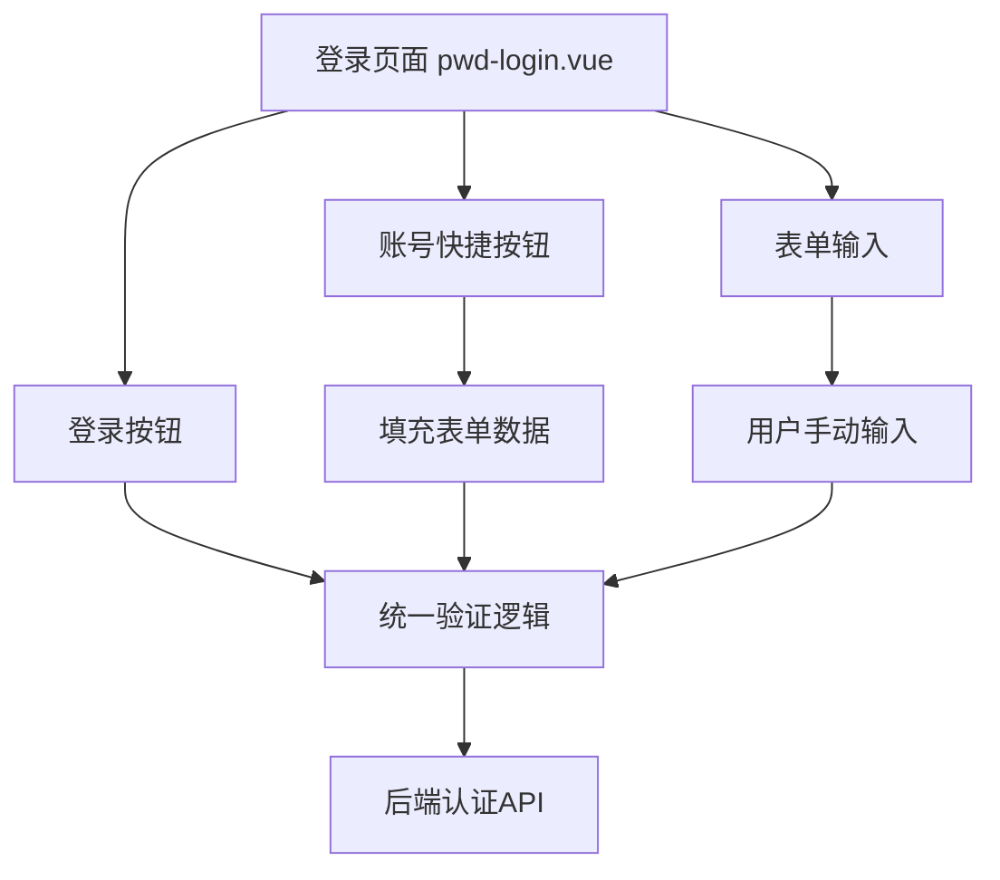
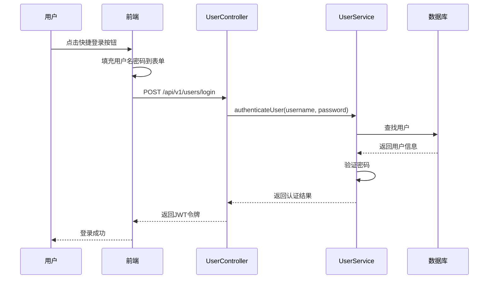

# 权限调整功能设计

## 1. 问题分析

### 1.1 当前问题
在派聪明的登录页面中，存在一个权限验证不一致的问题：
- **普通用户登录**：点击【普通用户】按钮时，会验证用户名和密码
- **管理员登录**：点击【管理员】按钮时，直接使用预设的用户名密码登录，未进行验证

### 1.2 期望行为
所有用户（包括管理员和普通用户）在登录时都应该验证用户名和密码，确保安全性。

## 2. 系统架构

### 2.1 前端架构


### 2.2 后端认证流程


## 3. 技术实现

### 3.1 前端修改方案
需要修改 `pwd-login.vue` 组件中的快捷登录逻辑：

#### 3.1.1 当前实现问题
```typescript
async function handleAccountLogin(account: Account) {
  await authStore.login(account.userName, account.password);
}
```
- 直接调用登录，绕过了表单验证

#### 3.1.2 修改后的实现
```typescript
function handleAccountLogin(account: Account) {
  // 将账号信息填充到表单中
  model.userName = account.userName;
  model.password = account.password;
  
  // 触发正常的表单提交流程，确保验证
  handleSubmit();
}
```

### 3.2 用户界面调整
- 保持快捷登录按钮的便利性
- 确保所有登录都经过表单验证
- 提供视觉反馈，用户可以看到填充的用户名密码

### 3.3 安全考虑
- 所有登录请求都必须经过后端 `authenticateUser` 方法验证
- 保持密码哈希比较的安全性
- 避免在前端硬编码敏感信息

## 4. 代码变更

### 4.1 前端组件修改
文件：`frontend/src/views/_builtin/login/modules/pwd-login.vue`

**修改点：**
1. **handleAccountLogin 方法**：从直接登录改为填充表单并触发正常验证流程
2. **用户体验优化**：点击快捷按钮后，表单会自动填充，用户可以看到填充的内容

**变更说明：**
- 移除直接调用 `authStore.login` 的逻辑
- 改为填充表单数据并调用 `handleSubmit`
- 确保所有登录都经过相同的验证流程

### 4.2 后端验证确认
当前后端实现已经正确：
- `UserController.login` 方法会调用 `userService.authenticateUser`
- `UserService.authenticateUser` 会验证用户名和密码
- 使用 `PasswordUtil.matches` 进行安全的密码比较

## 5. 测试验证

### 5.1 功能测试
- [ ] 点击【管理员】按钮，表单自动填充用户名密码
- [ ] 点击【普通用户】按钮，表单自动填充用户名密码  
- [ ] 填充后的表单需要通过正常的登录验证流程
- [ ] 手动输入错误密码时，登录应该失败
- [ ] 快捷按钮填充的密码修改后，应按修改后的密码验证

### 5.2 安全测试
- [ ] 确认管理员登录需要密码验证
- [ ] 确认普通用户登录需要密码验证
- [ ] 验证错误的用户名密码组合被拒绝
- [ ] 确认所有登录请求都经过后端验证

### 5.3 用户体验测试
- [ ] 快捷按钮仍然提供便利性
- [ ] 用户可以看到填充的用户名密码
- [ ] 用户可以修改填充的密码
- [ ] 登录流程保持一致

## 6. 实施步骤

### 6.1 代码修改
1. 修改 `pwd-login.vue` 中的 `handleAccountLogin` 方法
2. 测试快捷登录按钮的新行为
3. 确认所有登录路径都经过验证

### 6.2 测试验证
1. 在开发环境中测试修改后的登录流程
2. 验证安全性和用户体验
3. 确认后端日志记录正确的认证请求

### 6.3 部署发布
1. 前端构建并部署修改后的代码
2. 验证生产环境中的登录行为
3. 监控登录相关的日志和指标

## 7. 风险评估

### 7.1 低风险
- 修改仅涉及前端逻辑，不影响后端API
- 后端认证逻辑保持不变
- 现有的安全机制继续有效

### 7.2 注意事项
- 确保快捷按钮的便利性不受影响
- 验证所有登录路径的一致性
- 测试各种边界情况

## 8. 后续优化建议

### 8.1 密码安全
- 考虑移除前端硬编码的测试密码
- 在生产环境使用更强的密码策略
- 实施账户锁定机制防止暴力破解

### 8.2 用户体验
- 考虑添加"记住我"功能
- 实施更智能的表单自动填充
- 提供更好的错误提示信息

### 8.3 审计日志
- 记录所有登录尝试
- 区分成功和失败的登录
- 监控异常登录行为